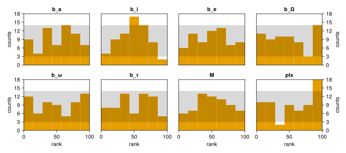

# Simulation Based Calibration

Simulation based calibration [Talts et al. 2020](https://ui.adsabs.harvard.edu/abs/2018arXiv180406788T) is a way to test the correctness and accuracy of a Bayesian model. 

It works by repeatedly generating simulated data from a model's priors, running inference, and examining the posterior. 
The result is a histogram that indicates if there is a net bias in the sampling procedure. An unbiased procedure & good model will result in flat histograms for each parameter.

Here is a worked example of performing simulated based calibration with an Octofitter model.

Note that this will not work well for models with very unconstrained priors on mass or semi-major axis / period. For example, if semi-major axis is set to a prior of LogUniform(0.0001, 10000) AU then many simulated systems will have planets unreasonably far or close the star and the uncertainties and epochs of observations will not make sense.
Actually, this reveals that these models are not all that reasonable: usually we do have fore-knowledge about the planet's semi-major axis etc. before we run any fits just because we detected it! 

We split this example in three parts: a model definition, a trial script that we run many times, and an analysis script that summarizes the results.


## Octofitter Model Template Script
This script defines the model we will be analyzing. The data likelihood we provide could be our real observations, or just arbitrary (even zero). The key parts are the epochs of the observations, number of observations, and uncertainties of the observations. The actual measured values will be repeatedly replaced by simulated values using Octofitter's generative models.


We will assume you have saved this as `sbc-model.jl`.
```julia
using Octofitter, Distributions

astrom_like = PlanetRelAstromLikelihood(
    (epoch=50000, ra=0.0, dec=0.0, σ_ra=10., σ_dec=10., cor=0),
    (epoch=50120, ra=0.0, dec=0.0, σ_ra=10., σ_dec=10., cor=0),
    (epoch=50240, ra=0.0, dec=0.0, σ_ra=10., σ_dec=10., cor=0),
    (epoch=50360, ra=0.0, dec=0.0, σ_ra=10., σ_dec=10., cor=0),
    (epoch=50480, ra=0.0, dec=0.0, σ_ra=10., σ_dec=10., cor=0),
    (epoch=50600, ra=0.0, dec=0.0, σ_ra=10., σ_dec=10., cor=0),
    (epoch=50720, ra=0.0, dec=0.0, σ_ra=10., σ_dec=10., cor=0),
    (epoch=50840, ra=0.0, dec=0.0, σ_ra=10., σ_dec=10., cor=0),
)

@planet b Visual{KepOrbit} begin
    a ~ truncated(Normal(10, 4), lower=0, upper=100)
    e ~ Uniform(0.0, 0.5)
    i ~ Sine()
    ω ~ UniformCircular()
    Ω ~ UniformCircular()
    τ ~ UniformCircular(1.0)
    P = √(b.a^3/system.M)
    tp =  b.τ*b.P*365.25 + 50420 # reference epoch for τ. Choose an MJD date near your data.
end astrom_like
@system SBC begin
    M ~ truncated(Normal(1.2, 0.1), lower=0)
    plx ~ truncated(Normal(50.0, 0.02), lower=0)
end b
model = Octofitter.LogDensityModel(SBC)
```

## SBC Trial Script
This script runs a single SBC trial. If you name it `sbc-trial.jl`, 
then you can run it as `julia sbc-trial.jl trial_num` where `trial_num`
is a unique number to identify this trial. You would then run this script
many times (say, 100+). You could run these trials on a compute cluster if desired.
```julia
using Octofitter, Distributions, PlanetOrbits
using Printf

include("sbc-model.jl")

sbc_index = parse(Int, ARGS[1])


@info "Running SBC trial $sbc_index"
outname = @sprintf("sbctest-%04d", sbc_index)


# Seed reproducibly from the index of this trial
using Random
rng = Random.Xoshiro(sbc_index)

# Sample system parameters from priors
θ_system_flat = model.sample_priors(rng)

settings = (;
    # Sampler parameters if desired:
    # :target_accept=>0.95,
    # :adaptation=>5000,
    # :iterations=>5000,
    # :tree_depth=>13,
    # :verbosity=>2,

    # Model parameter values
    θ = θ_system_flat
)

Octofitter.sbctrial(model.system, settings, outname);
println("done $sbc_index")
```


## SBC Analysis Script
```julia
using Octofitter
using DataFrames
using MCMCChains
using TOML
using CairoMakie


# These are the variables we would like to examine
vars = [
    :b_a,
    :b_i,
    :b_e,
    :b_Ω,
    :b_ω,
    :b_τ,
    :M,
    :plx,
]

# Load statistics from each trial

# Get list of trials
rankfnames = filter(endswith("rank_stats.toml"), readdir())
chainnames = filter(endswith("chains.fits"), readdir())

# Check RHat convergence criteria of each posterior.
ii = findall(map(eachindex(chainnames)) do i
    chainfname = chainnames[i]
    chn = Octofitter.loadchain(chainfname)
    rhats = MCMCChains.rhat(chn)[vars][:,2]
    passed = maximum(abs, 1 .- rhats) .< 0.2
    if !passed 
        @warn "Trial $(chainnames[i]) skipped due to poor convergence"
    end
    return passed
end)

# gather rank statistics
ranks = DataFrame(map(rankfnames[ii]) do rankfname
    NamedTuple(Symbol(k)=>float(v) for (k,v) in TOML.parsefile(rankfname))
end)

# How many bins per histogram
nbins=floor(Int, sqrt(length(ii)))

# How many columns for figure
cols = 4


fig = Figure(
    size=(225cols,200cld(length(vars),cols))
)


for i in eachindex(vars)
    col = mod1(i,cols)
    row = fld1(i,cols)
    ax = Axis(
        fig[row,col];
        xlabel="rank",
        ylabel="counts",
        title=string(vars[i]),
        xgridvisible=false,
        ygridvisible=false,
        yaxisposition= col < cols ? :left : :right
    )
    # nbins=25
    xlims!(ax, 0, 100)
    bin_edges = range(start=0,stop=100+0.001,length=nbins)#.*10
    hist!(ax, getproperty(ranks, vars[i]), bins=bin_edges, color=Makie.wong_colors()[2])
    expected = size(ranks,1)/nbins
    p = Poisson(expected)
    hspan!(ax,
        quantile(p, [0.02,0.98])...,
        color=(:black,0.15)
    )
    ylims!(ax, low=0, high=quantile(p, 0.999))

    row == 1 && Makie.hidexdecorations!(ax)
    1 < col < cols && Makie.hideydecorations!(ax)
end
Makie.colgap!.((fig.layout,), 1:(cols-1), 30.0)
save("sbc-summary.png", fig)
save("sbc-summary.pdf", fig)
save("sbc-summary.svg", fig)
fig
```


For a perfectly unbiased model & sampling algorith, the histogram bins should be flat to within about the ±1σ shaded expected region.

In this example and model, see that the inclination parameter estimates are *under confident*. That is, on average the computed marginal posterior of the inclination parameter is slightly too wide and the true uncertainty is lower.